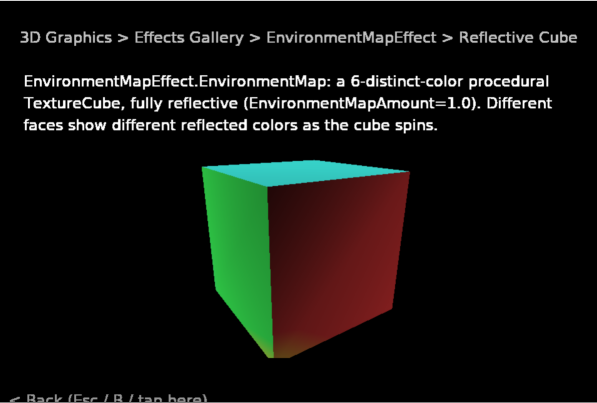

# CNA Examples

A single, cross-platform, in-app catalog of live demonstrations for every area of
[CNA](https://github.com/libcna/cna) — a C++ reimplementation of the XNA 4.0 programming
model built on SDL3. Conceptually inspired by
[javafx-ensemble8](https://github.com/lusalome/javafx-ensemble8) (a browsable sample catalog with
in-app navigation), but entirely CNA-specific — no JavaFX code, assets, or dependency involved.

Pick an area from the home menu, drill into a category, and run the demo — all inside one
application, on desktop, web or mobile.

See [plan.md](plan.md) for the architecture, the CNA API coverage analysis, and the roadmap.
[plan20260727.md](plan20260727.md) is the archived previous plan, kept as the record of how the
first seven areas were built and verified.

## Screenshot



## Status

**13 areas, 79 categories, 248 demo screens**, every one of them exercising a real
`Microsoft::Xna::Framework` / `CNA::*` API call rather than a mock.

| Area | Categories | Screens |
|---|---|---:|
| Framework | Game Loop, Game Components, Services & Dispatcher, Window, Device Manager | 17 |
| Math | Vectors, Matrix & Quaternion, Geometry, Curves, Color & Packed Vectors | 16 |
| Content | ContentManager Basics, Manifest, CNJ Format, XNB Format, Errors | 7 |
| Storage | StorageDevice, StorageContainer | 4 |
| Diagnostics | Logging, Platform & Build, Backend & Capabilities, Adapter & Display | 4 |
| Input | Keyboard, Mouse, Gamepad, Touch, Other | 52 |
| Audio | SoundEffect, SoundEffectInstance, 3D Audio, DynamicSoundEffectInstance, Microphone, XACT | 12 |
| Devices | Sensors, Vibration, Camera, System & Display, Power, Desktop Integration | 15 |
| Net | NetworkSession, NetworkGamer, GamerServices, Leaderboards | 15 |
| Media | Song, Video, MediaLibrary, Pictures | 17 |
| Avatars | AvatarDescription, AvatarRenderer, Lighting & Variation | 7 |
| 2D Graphics | 4 groups, 13 categories | 40 |
| 3D Graphics | 5 groups, 17 categories | 42 |

Run `./build/cna_examples --list-demos` for the full, authoritative list.

`tools/check_catalog.py` compares the current totals and area table with the screen files and
registrations in `src/Navigation/CatalogAreas/`.

### Verification status

- **Verified against real hardware on the dev machine:** Keyboard, Mouse, most of Input's "Other"
  category, and Audio.
- **Verified headlessly (rendering + behaviour):** the Media and Framework areas,
  via `tools/sweep.sh` and `tools/check_shots.py`. Framework additionally verifies that every
  screen restores the global state it changes: after the resolution demo changes the back buffer
  to 800x600 and leaves, the buffer is measurably back to 960x640. The Math area's on-screen
  claims are additionally asserted by `tools/checks/math_claims.cpp`, which caught three
  confidently-wrong statements before they shipped. The Content and Audio areas have the same
  treatment in `tools/checks/cnj_claims.cpp` and `tools/checks/xact_claims.cpp` — necessary
  because those screens catch their own exceptions, so a total failure still renders a clean
  screenshot and passes a sweep.
- **Self-checking screens:** the 3D area's Volume & Cube Textures screens compute their own
  pass/fail (a `GetData` round trip, an occluded-vs-visible pixel count) and draw the verdict as
  a coloured swatch, so a sweep can assert correctness by pixel rather than by "it rendered".
  That is how `RenderTargetCube::GetData` was found to return zeros silently on EASYGL.
- **Renders correctly and degrades gracefully, but never exercised with the real device:**
  Gamepad, Touch, and Input's joystick/haptics screens (no controller, touchscreen, raw joystick
  or haptic device available); Devices' mobile-only Sensors/Vibration screens; Camera
  (no webcam); MessageBox/FileDialog (need a human).
- **Renderers:** The 2026-09-28 `OPENGLES3` sweep produced 248/248 screenshots with no blank or
  overflowing screen. `SDL_RENDERER` was verified before the catalog changed from 249 to 248;
  its current catalog needs a fresh sweep.
  `SDL_RENDERER` is 2D-only by design, so the 3D Graphics area is gated on
  `GraphicsDevice::SupportsCapability(ThreeD)` and those demos explain themselves rather than
  throwing. See `plan.md` §4.
- **Web:** An Emscripten `WEBGL2` build linked on 2026-10-01. Its Node CLI listed 245 demos;
  the three Video demos are omitted because CNA disables video in this configuration.
  Browser rendering still needs a browser run. The native Avatars sweep passed 7/7 after
  migration to the current CNA avatar API.

## Navigating the app

- **Keyboard/gamepad:** Up/Down (or D-pad/left stick) to move the selection, Enter/Space/gamepad
  A to select, Esc/gamepad B to go back.
- **Mouse/touch:** click or tap an entry to select it; click/tap the "< Back" hint at the
  bottom-left to go back.
- A category with more entries than fit on screen scrolls automatically to keep the selected
  entry visible as you navigate with Up/Down.

## Running a single demo headlessly

The app can open straight into one demo and capture it, with no window manager and no synthetic
X11 input — this is what the verification sweeps use:

```bash
./build/cna_examples --list-demos
./build/cna_examples --list-demos --search "fromstream"   # same matcher the search screen uses
tools/headless.sh --demo "Media/Pictures/Browse" --frames 90 --screenshot /tmp/browse.png
tools/headless.sh --demo "Album/Artist/Genre" --keys select,down,select --frames 120
tools/headless.sh --search "occlusion" --frames 70     # open search with a query pre-filled
tools/headless.sh --keys down,select,select --pointer 480,560,300 --frames 200   # drag gesture
```

`--demo` accepts a full `Area/Category/Demo` path or any unambiguous substring. `--keys` scripts
menu actions (`up`, `down`, `select`, `cancel`), one every `--key-interval` frames. Any run with
`--frames` ignores real input devices entirely, so a sweep cannot be perturbed by a stray event.

**Use `tools/headless.sh` for captures.** It selects SDL's offscreen driver and avoids a display
server. Set `SDL_VIDEODRIVER=x11` to use its Xvfb fallback on a build without offscreen support:

```bash
tools/headless.sh --demo "Media/Song/Visualization" --frames 150 --screenshot /tmp/vis.png
tools/sweep.sh                 # screenshot every demo
tools/sweep.sh Media           # ...or just the ones matching a filter
tools/check_shots.py build/screenshots   # flag blank/overflowing screens

# Run against an existing second-backend build tree when one is available:
tools/sweep_backend.sh <build-dir>
```

## Platforms

| Tier | Platforms |
|---|---|
| Now | Windows, Linux |
| Build verified | Web (Emscripten); browser rendering pending |
| Later | Android, macOS, iPhone, consoles |

## Prerequisites

| Tool | Version |
|---|---|
| CMake | ≥ 3.20 |
| C++ compiler | C++23 (GCC 13+, Clang 16+, MSVC 19.38+) |
| CNA | sibling directory `../cna` |
| sharp-runtime | sibling directory `../sharp-runtime` |

Clone all three side-by-side:

```
libcna/
├── cna/
├── sharp-runtime/
└── cna-examples/       ← this repo
```

## Building

```bash
cmake -B build -DCMAKE_BUILD_TYPE=Debug \
  -DCMAKE_CXX_COMPILER_LAUNCHER=ccache -DCMAKE_C_COMPILER_LAUNCHER=ccache
cmake --build build --parallel --target cna_examples
```

Run it:

```bash
./build/cna_examples
```

Use the shared `ccache` and reuse the existing build tree. Lower parallelism for a
memory-heavy target if necessary; see `../AGENTS.md` for the machine's current rules.

Fast checks are registered with CTest and run without a graphics device:

```bash
ctest --test-dir build --output-on-failure
```

They validate the source catalog, layout rules, executable demo list, search and CLI errors.
GitHub Actions also runs the source checks on pushes and pull requests. A full screenshot
sweep remains a separate renderer check.

To build the web version with an activated Emscripten SDK:

```bash
emcmake cmake -S . -B build-web -G Ninja -DCMAKE_BUILD_TYPE=Debug \
  -DCNA_GRAPHICS_RENDERER=WEBGL2 -DCNA_ENABLE_EMSCRIPTEN_THREADS=OFF \
  -DCNA_ENABLE_DRACO=OFF
cmake --build build-web --parallel 4 --target cna_examples
(cd build-web && node cna_examples.js --list-demos | wc -l)  # 245
python3 -m http.server 8000 --directory build-web
```

Open `http://localhost:8000/cna_examples.html` in a browser to test rendering.

The graphics renderer defaults to `OPENGLES3` (CNA's EasyGL implementation); override with
`-DCNA_GRAPHICS_RENDERER=<SDL_RENDERER|OPENGLES2|OPENGLES3|OPENGL33|VULKAN|BGFX|WEBGPU>` if
needed (subject to CNA's own renderer maturity).

## Project structure

```
cna-examples/
├── plan.md                        Architecture, CNA coverage analysis, roadmap
├── plan20260727.md                Archived previous plan
├── CMakeLists.txt                 Top-level build (sibling add_subdirectory of ../cna)
├── Content/                       Menu font + UI textures + demo media
│   ├── MediaDemo/                 ffmpeg-generated tones and a test video clip
│   └── MediaLibraryDemo/          A synthetic music/picture library (see tools/)
├── tools/
│   ├── gen_menu_font.py           Regenerates the menu SpriteFont from a system TTF
│   ├── gen_media_library.sh       Regenerates Content/MediaLibraryDemo/
│   ├── headless.sh                Run one demo with SDL's offscreen driver
│   ├── sweep.sh                   Screenshot every demo
│   ├── sweep_backend.sh           ...from a non-default build tree (a second backend)
│   ├── check_shots.py             Flag blank or overflowing screenshots
│   ├── check_layout.py            Flag hardcoded bottom-of-window draw positions
│   ├── check_catalog.py           Screens vs registrations vs docs consistency
│   ├── check_cli.py               Catalog CLI and argument validation
│   └── checks/                    Programs asserting what demos claim on screen
│       ├── math_claims.cpp        (caught three wrong statements before release)
│       └── cnj_claims.cpp         (.cnj loaders, envelope and fail-fast rules)
└── src/
    ├── Program.cpp                 Entry point + CLI
    ├── CnaExamplesGame.hpp         Game subclass; GraphicsDeviceManager + ScreenManager
    ├── Harness/                    Headless driver: option parsing, flat demo index
    ├── GameStateManagement/        Screen-stack navigation (adapted from the XNA
    │                                "Game State Management" sample)
    ├── Navigation/                 Menus, AreaCatalog.hpp (public catalog data),
    │   └── CatalogAreas/            one registration source per area
    └── Demos/                      One subfolder per Area, one file per demo screen
```

Adding a demo means: write a `DemoScreen` subclass under `Demos/<Area>/<Category>/`, then
register it with `MakeDemo<YourScreen>(title, description)` in the corresponding
`Navigation/CatalogAreas/<Area>.cpp` file. Run `tools/check_catalog.py` afterwards.

All bundled media is synthetic — generated by `ffmpeg` from `lavfi` sources, or built
procedurally at runtime. No third-party audio, video, image or metadata is shipped.

The one exception is *borrowed, not bundled*: the Content area's `.xnb` demos need real
MonoGame-produced files, which CNA can read but never write. Those are copied out of
`../cna/tests/assets/xnb` into the build output at build time and are **not** in version
control — they are Ms-PL, and this repository is MIT. `FontCalibri14.xnb` is excluded even
from that copy, because it embeds a rasterised Calibri glyph atlas. Build without `../cna`
and the XNB demos report the fixtures as unavailable instead of failing.

## Development

Active development happens on the `develop` branch; `master` tracks the latest stable state.

## License

MIT — see [LICENSE](LICENSE). This is original CNA-specific work, not a port of Microsoft's
XNA sample collection (compare `../cna-samples`, which is Ms-PL for that reason).
